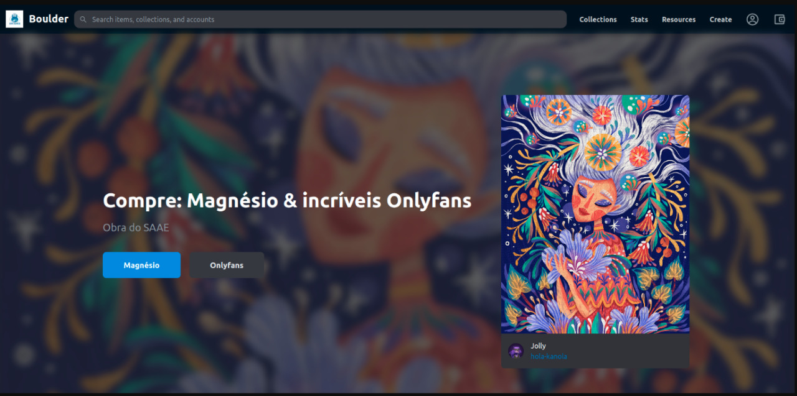

# -- Blockchain -- # boulder-sorocaba
> ### App da Academia Boulder de Sorocaba

[<p style="text-align: center"><br>What is Market Cap (Market Capitalization) in Crypto? 📈</p>](https://www.youtube.com/watch?v=WV0Gr0PkCtY)

## como subir o codigo

git add --all
git commit -m "<eu n irei esquecer de colocar um comentario>"
git push origin main

## como iniciar a aplicação

yarn dev

## urls utilizadas

> Sanity : http://localhost:3333/desk
> Next.js App : http://localhost:3000/
> 


## 1 - Script para criação do projeto:

yarn create next-app -e with-tailwindcss boulder-sorocaba

> Como iniciar a aplicação

yarn dev

## 2 - Criação de um banco de dados de conteúdo

mkdir studio
cd studio
sanity init --coupon cleverprogrammer

Project name: boulder
Select project template: Clean project with no predefined schemas

## 3 - Conect sua Wallet na Thirdweb

Link : https://thirdweb.com/start

## 4 - Faça o deploy do Smart Contract

https://thirdweb.com/goerli/0xCe1754A02b1475198871E1bCd32caf6a8129075b/

0xCe1754A02b1475198871E1bCd32caf6a8129075b

    <a href="https://thirdweb.com/goerli/0xCe1754A02b1475198871E1bCd32caf6a8129075b?utm_source=contract_badge" target="_blank">
      
    </a>

## 5 - execute o comando sanity start

sanity start

## 6 - instalar lib react-icons

yarn add react-icons

## 7 - instalar lib 3rdweb/hooks

yarn add @3rdweb/hooks

## 8 - instalar lib sanity/client

yarn add @sanity/client

## Repo video:

https://github.com/CleverProgrammers/opensea-blockchain-youtube.git


##

## Video

| [<br><p style="text-align: left">Entendendo o seu Comportamento - Raphael Molesim</p>](https://www.youtube.com/watch?v=x3eRXeMB-4k&t=36s) |
| :---: |
```python

help.msg(title="[Documentação|Links]", message="""

https://www.youtube.com/watch?v=x3eRXeMB-4k&t=36s

"""
, **options)

```

In this tutorial, you're gonna be building the Opensea Blockchain Web 3.0 App using Next JS, Sanity.io, thirdweb, Tailwind CSS, and Vercel 🔥

> Get early access to thirdweb 👉  https://thirdweb.com/start?utm_source...

> Get the free boosted plan with Sanity 👉  https://www.sanity.io/cleverprogrammer

> 🗄️ Link to the assets: https://drive.google.com/drive/folder...

> @Coder Coder How to Make a Background Image Transparent in CSS 👉 https://www.youtube.com/watch?v=LQsjN...

> 🔗 GitHub Repo: https://github.com/CleverProgrammers/...

## You'll be learning about:

* 👉  Building a Web 3.0 Application with Next JS

* 👉  Styling your app using Styled Components

* 👉  Create and mint your own NFT Tokens using the thirdweb SDK

* 👉  Adding Web 3.0 authentication using Metamask

* 👉  Storing data and information about the tokens you created in Sanity.io 

* 👉  Using GROQ to retrieve data from Sanity Studio and display it in your Web 3.0 App

* 👉  Creating a send and receive functionality for your NFTs on the blockchain
* 👉  Deploy and host the app on Vercel 

## Buckle up, buttercup 🚀

⏲️  Timestamps

* 00:00:00 - Intro
* 00:01:32 - Demo Opensea Clone App
* 00:06:21 - Setting up NextJS
* 00:22:28 - Add Navbar
* 00:37:24 - Add Hero
* 00:46:58 - Set up Metamask Authentication with NextJS
* 01:07:31 - Build NFT Collection Page
* 01:37:26 - Add NFT Detail Page
* 01:59:27 - Set up NFT Direct Listing Purchase using NextJS and Thirdweb
* 02:14:35 - Deploy NextJS App to Vercel
* 02:21:27 - Outro
 

=======================================================

👨👩👧👦  Join our Discord Community: https://cleverprogrammer.com/discord
🚀 Join Profit with React: https://www.cleverprogrammer.com/pwr?...
🤝 Attend our meetups: https://www.cleverprogrammer.com/meetups

#web3 #frontend #blockchaindeveloper