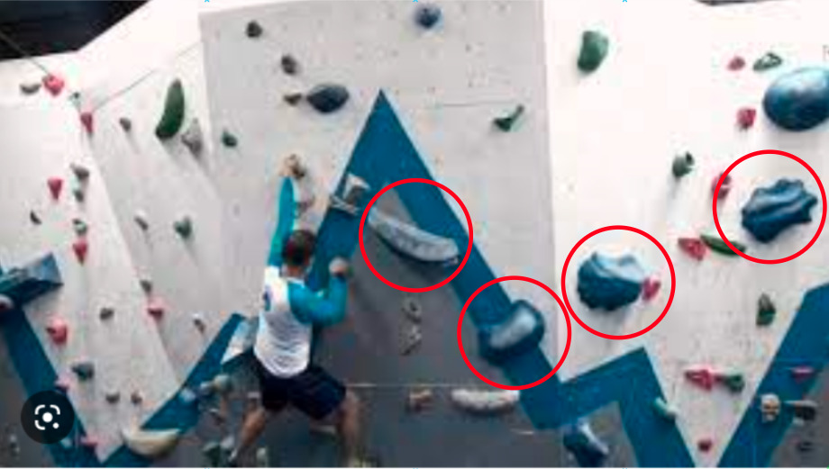
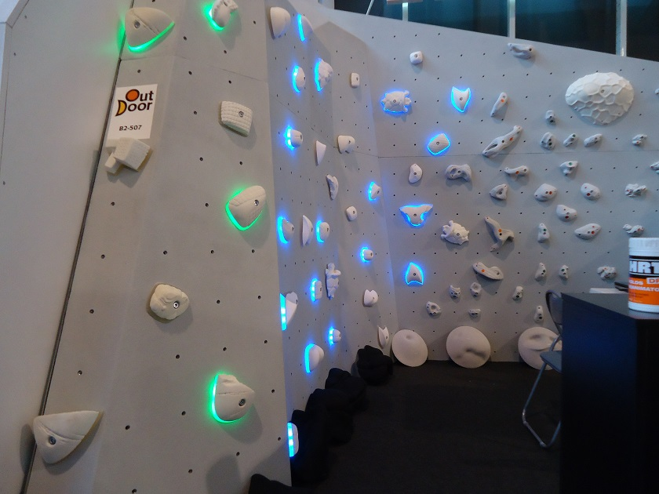
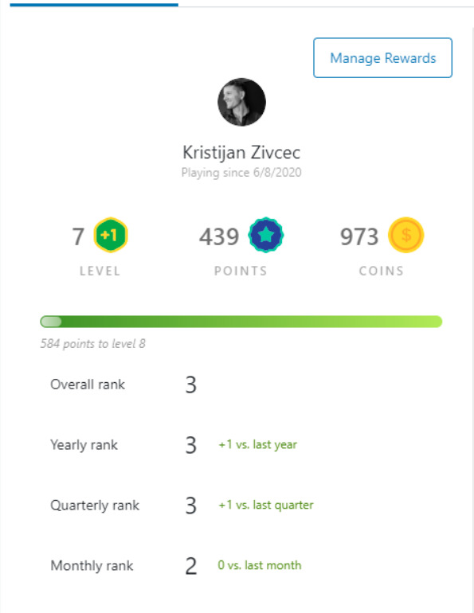
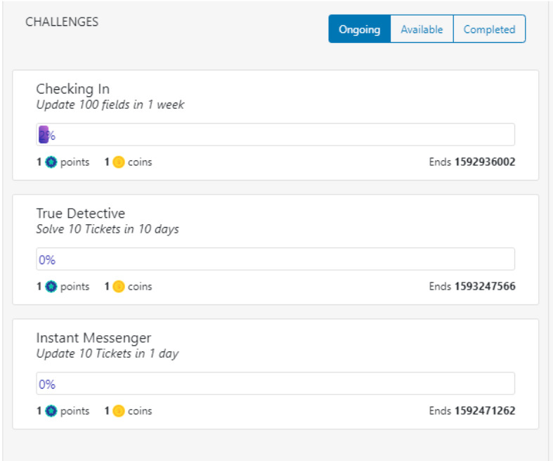
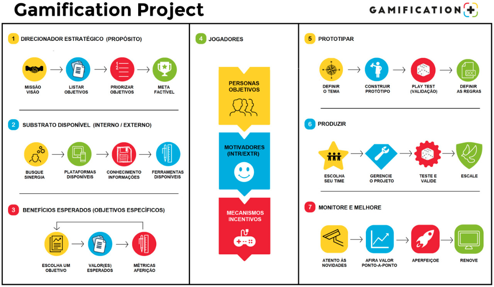

# -- Blockchain -- # DApp - boulder-sorocaba
> ### DApp da Academia Boulder de Sorocaba

[<p style="text-align: center"><br>.</p>](https://www.youtube.com/watch?v=WV0Gr0PkCtY)

## Para que serve

DApp da comunidade Academia boulder-sorocaba.

* Compre produtos / Jogue / Aprenda / Viva em Comunidade

## Loja / Store

  * Magnésio para esportes

    

  * Fans Eron (@heronrxdriges)

    

  * Fans sapatilhas da Boulder

    

## Tools & Comunidade.

  > ### [Cadastro_de_Vias] - Crie, favorite, mande uma sugestão.

  

  > ### [Parede_LED] - Cadastre um via na parede LED.

  

  > ### [Gamification] - Ganhe XP, faça missões, jogue.

  

  ### Profile
  
  Avance de level, ganhe pontos e moedas.

  

  
  
  

  ### Jogos

    - ### Básicos
    
    - [x] Mão esquerda par. / Mão direita ímpar.
    - [x] Trajetos : apenas as ROXAS até o final do boulder.
    - [x] Desafios : resistência | equilíbrio | elasticidade | força | explosão  

    - ### Matemáticos (escalada para seu filho aprender a tabuada)

    - [x] Mão direita multiplo de 1.
    - [x] Mão esquerda potenciação.

    - ### Doar um Beta de alguma via.

    - [x] - Cadastrar o Beta.
    - [x] - Compartilhar com a comunidade.
    - [x] - Dicas de segurança.
    - [x] - Treinos que me ajudaram a fazer esse **'move'**.
    - [x] - Técnica de respiração.
    - [x] - Técnica de KIAI. (gravação do som / principais músculos)

  ### Missões

    - [x] - Faça todas as vias Amarelas.
    - [x] - Faça a via numérica até a agarra 50.
    - [x] - Faça a via numérica até a agarra 100.
    - [x] - 100 checkins.
    - [x] - Treine das 6h as 8h e ganhe o dobro de XP.
    - [x] - Crie uma via
    - [x] - Mande a via que vc criou.
    - [x] - Doe um Beta.


  * [Gamification__com_Realidade_aumentada_e_QRCODE]
  
    - [x] - Veja objetos 3D animados na tela do seu celular assim como "pokemon go" só que você irá capturar a via.

    

    

    - [x] - Interaja com a parede, como se fosse uma tela do celular.

    

  * [Vídeos] - Melhores momentos Academia.

  * [Onboarding] - Como começar a escalar.

# Documentação técnica 

## como subir o código

* git add --all
* git commit -m "<comentario>"
* git push origin main

## como criar uma branch

* git checkout -b feature/<nome da branch sem espaço ou acentuação>
* git branch

## como iniciar a aplicação

> Como iniciar a aplicação

* yarn dev

## urls utilizadas

> Sanity : http://localhost:3333/desk

> Next.js App : http://localhost:3000/

> Conect sua Wallet na Thirdweb: https://thirdweb.com/start

## Principais comandos

* Script para criação do projeto: ```yarn create next-app -e with-tailwindcss boulder-sorocaba```

* Criação de um banco de dados de conteúdo: 
```
mkdir studio
cd studio
sanity init --coupon cleverprogrammer
```

* Iniciar o Banco de dados de conteúdo : ```sanity start```

* Iniciar o Banco de dados de conteúdo : ```sanity start```

* Dependências :
```
yarn add react-icons
yarn add @3rdweb/hooks
yarn add @sanity/client
yarn add react-hot-toast
yarn add @3rdweb/sdk
yarn upgrade --lates 
```

### Authentication


### Content database


- Configuração de CORS


## Produtos

### Magnésio


### Onlyfans Heron


### Onlyfans Pés integrantes da Boulder


## Repo video:

https://github.com/CleverProgrammers/opensea-blockchain-youtube.git


## Referencias

The web3 development platform : https://www.alchemy.com/

## Video

| [<br><p style="text-align: left">Entendendo o seu Comportamento - Raphael Molesim</p>](https://www.youtube.com/watch?v=x3eRXeMB-4k&t=36s) |
| :---: |
```python

help.msg(title="[Documentação|Links]", message="""

https://www.youtube.com/watch?v=x3eRXeMB-4k&t=36s

"""
, **options)

```

In this tutorial, you're gonna be building the Opensea Blockchain Web 3.0 App using Next JS, Sanity.io, thirdweb, Tailwind CSS, and Vercel 🔥

> Get early access to thirdweb 👉  https://thirdweb.com/start?utm_source...

> Get the free boosted plan with Sanity 👉  https://www.sanity.io/cleverprogrammer

> 🗄️ Link to the assets: https://drive.google.com/drive/folder...

> @Coder Coder How to Make a Background Image Transparent in CSS 👉 https://www.youtube.com/watch?v=LQsjN...

> 🔗 GitHub Repo: https://github.com/CleverProgrammers/...

## You'll be learning about:

* 👉  Building a Web 3.0 Application with Next JS

* 👉  Styling your app using Styled Components

* 👉  Create and mint your own NFT Tokens using the thirdweb SDK

* 👉  Adding Web 3.0 authentication using Metamask

* 👉  Storing data and information about the tokens you created in Sanity.io 

* 👉  Using GROQ to retrieve data from Sanity Studio and display it in your Web 3.0 App

* 👉  Creating a send and receive functionality for your NFTs on the blockchain
* 👉  Deploy and host the app on Vercel 

## Buckle up, buttercup 🚀

⏲️  Timestamps

* 00:00:00 - Intro
* 00:01:32 - Demo Opensea Clone App
* 00:06:21 - Setting up NextJS
* 00:22:28 - Add Navbar
* 00:37:24 - Add Hero
* 00:46:58 - Set up Metamask Authentication with NextJS
* 01:07:31 - Build NFT Collection Page
* 01:37:26 - Add NFT Detail Page
* 01:59:27 - Set up NFT Direct Listing Purchase using NextJS and Thirdweb
* 02:14:35 - Deploy NextJS App to Vercel
* 02:21:27 - Outro
 

=======================================================

👨👩👧👦  Join our Discord Community: https://cleverprogrammer.com/discord
🚀 Join Profit with React: https://www.cleverprogrammer.com/pwr?...
🤝 Attend our meetups: https://www.cleverprogrammer.com/meetups

#web3 #frontend #blockchaindeveloper