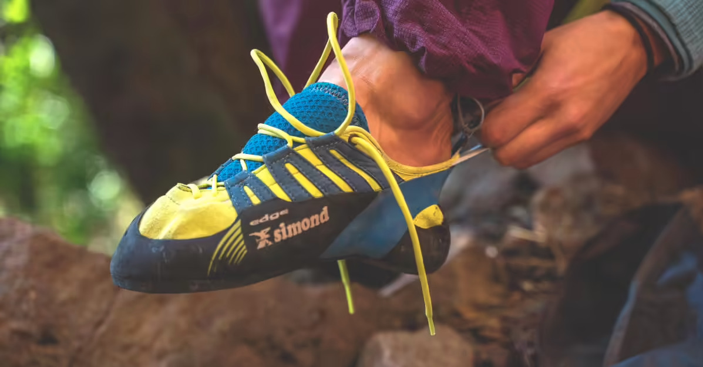
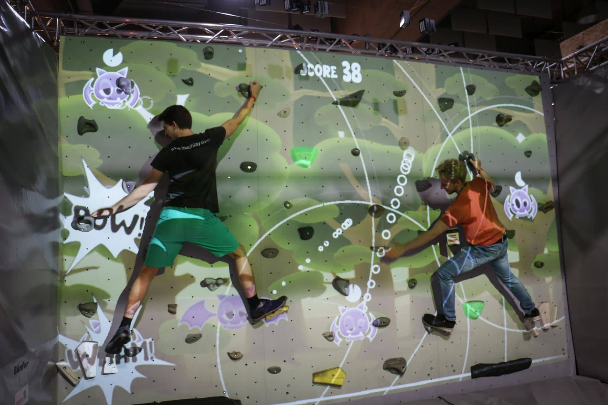

https://thirdweb.com/

# -- Blockchain -- # DApp - boulder-sorocaba
> ### DApp da Academia Boulder de Sorocaba

[<p style="text-align: center"><br>.</p>](https://www.youtube.com/watch?v=WV0Gr0PkCtY)

## Para que serve

Esse projeto tem como objetivo ser um template para a criação de uma DApp para uma academia de escalada.

## Principais funcionalidades

* Compre produtos
* Jogue
* Aprenda
* Comunidade

## Loja / Store

  * Magnésio para esportes

    

  * Fans Eron (@heronrxdriges)

    

  * Fans sapatilhas da Boulder

    

## Tools & Comunidade.

  > ### [Cadastro_de_Vias] - Crie, favorite, mande uma sugestão.

  

  > ### [Parede_LED] - Cadastre um via na parede LED.

  

  > ### [Gamification] - Ganhe XP, faça missões, jogue.

  

  ### Profile
  
  Avance de level, ganhe pontos e moedas.

  

  
  
  

  ### Jogos

    - ### Básicos
    
    - [x] Mão esquerda par. / Mão direita ímpar.
    - [x] Trajetos : apenas as ROXAS até o final do boulder.
    - [x] Desafios : resistência | equilíbrio | elasticidade | força | explosão  

    - ### Matemáticos (escalada para seu filho aprender a tabuada)

    - [x] Mão direita multiplo de 1.
    - [x] Mão esquerda potenciação.

    - ### Doar um Beta de alguma via.

    - [x] - Cadastrar o Beta.
    - [x] - Compartilhar com a comunidade.
    - [x] - Dicas de segurança.
    - [x] - Treinos que me ajudaram a fazer esse **'move'**.
    - [x] - Técnica de respiração.
    - [x] - Técnica de KIAI. (gravação do som / principais músculos)

  ### Missões

    - [x] - Faça todas as vias Amarelas.
    - [x] - Faça a via numérica até a agarra 50.
    - [x] - Faça a via numérica até a agarra 100.
    - [x] - 100 checkins.
    - [x] - Treine das 6h as 8h e ganhe o dobro de XP.
    - [x] - Crie uma via
    - [x] - Mande a via que vc criou.
    - [x] - Doe um Beta.

    - ### Doar um Beta de alguma via. (XP)

    - [x] - Cadastar o Beta.
    - [x] - Compartilhar com a comunidade.
    - [x] - Dicas de segurança.
    - [x] - Teinos que me ajudaram a fazer esse **'move'**.
    - [x] - Tecnica de respiração.
    - [x] - Tecnica de KIAI. (gravação do som / principais musculos)

  > ### [Gamification__com_Realidade_aumentada_e_QRCODE]

  

  

  

  

  

  
  
    - [x] - Veja objetos 3D animados na tela do seu celular assim como "pokemon go" só que você irá capturar a via.

    - [x] - Interaja com a parede, como se fosse uma tela do celular.

    

  * [Vídeos] - Melhores momentos Academia.

  * [Onboarding] - Como começar a escalar.

# Documentação técnica 

## como subir o código

* git add --all
* git commit -m "<comentario>"
* git push origin main

## Como criar uma branch

* git checkout -b feature/<nome da branch sem espaço ou acentuação>
* git branch

## Como instalar

```
yarn
```

## Como iniciar a aplicação

* yarn dev

## Conecte a sua MetaMask na rede Goeli

https://www.buybitcoinbank.com/pt/cryptocurrency/add-goerli-to-metamask

## Principais comandos utilizados

* Script para criação do projeto: ```yarn create next-app -e with-tailwindcss boulder-sorocaba```

* Criação de um banco de dados de conteúdo: 
```
mkdir studio
cd studio
sanity init --coupon cleverprogrammer
```

* Iniciar o Banco de dados de conteúdo : ```sanity start```

* Dependências :
```
yarn add react-icons
yarn add @3rdweb/hooks
yarn add @sanity/client
yarn add react-hot-toast
yarn add @3rdweb/sdk
yarn upgrade --lates 

yarn add react-bootstrap bootstrap
```

## Como realizar um query no Sanity

https://www.sanity.io/docs/groq

### Authentication


### Content database


- Configuração de CORS


## UI/UX Guide ##

https://react-bootstrap.github.io/components/alerts

## Images Guide

https://nextjs.org/docs/api-reference/next/image

## Produtos

### Magnésio


### Fans Heron


### Fans Pés integrantes da Boulder


# Links

* Acesso Site : https://confraria-web3.vercel.app/

* Link do projeto na Vercel : https://vercel.com/govinda777/confraria-web3/settings

* UI / UX : https://react-bootstrap.github.io/components/alerts

* UI / UX : https://react-bootstrap.github.io/components/alerts

# Links Dev

> Sanity : http://localhost:3333/desk

> Next.js App : http://localhost:3000/

> Conect sua Wallet na Thirdweb: https://thirdweb.com/start